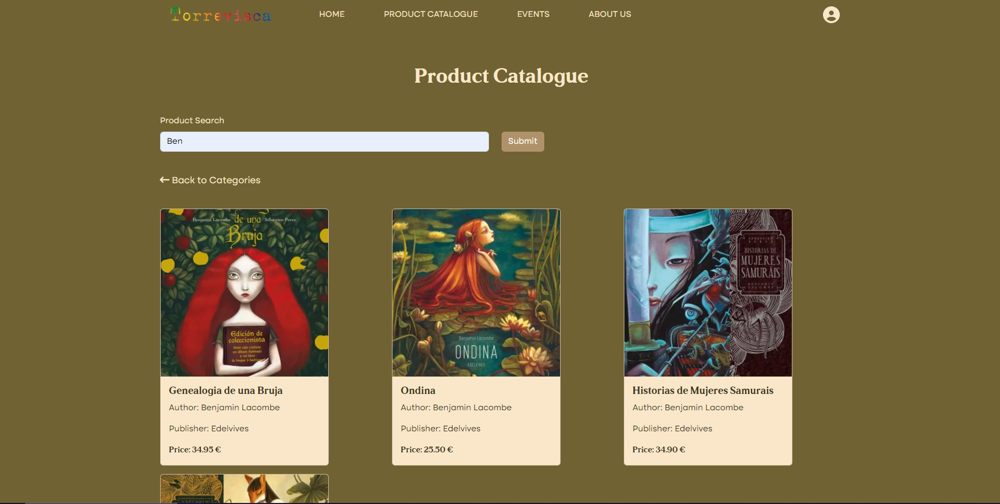
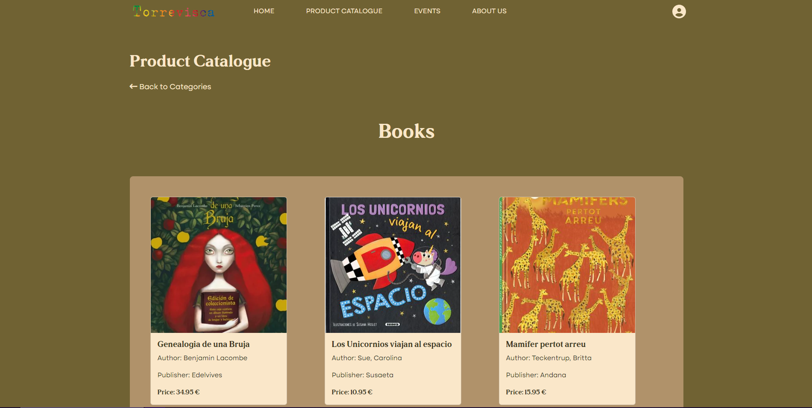
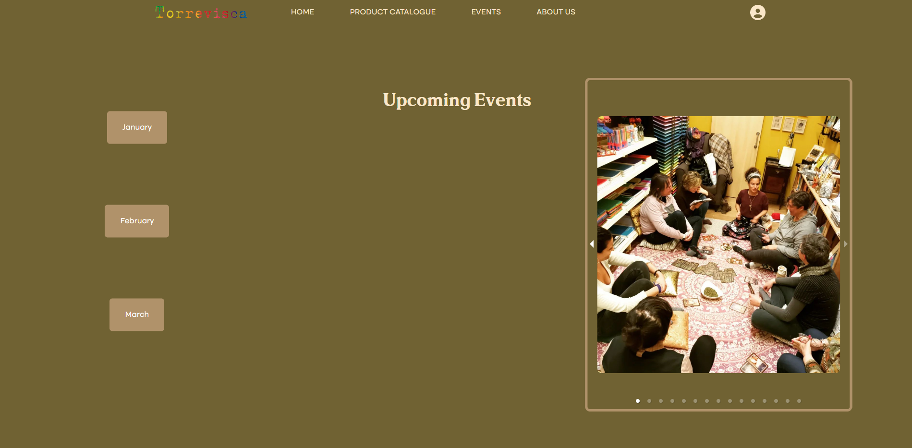
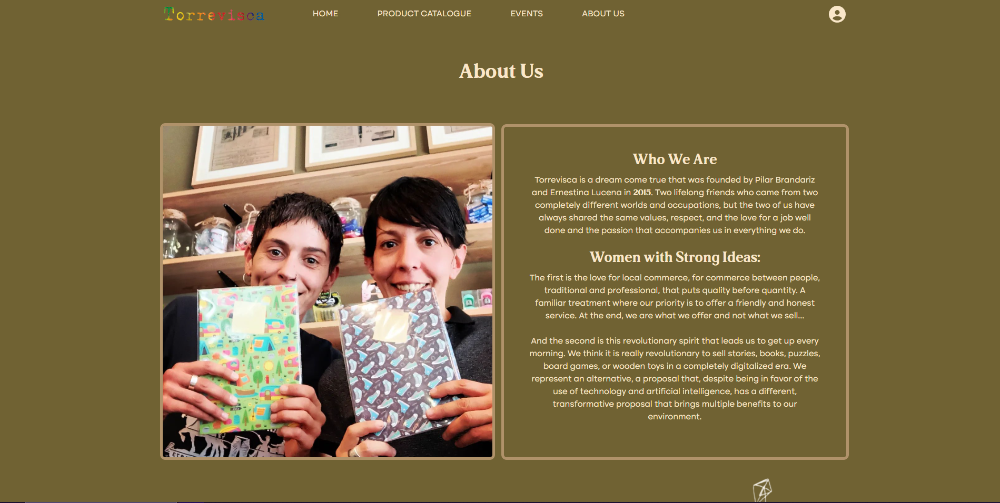
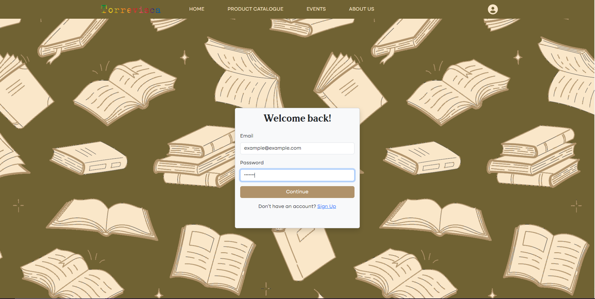

# Llibreria-Torrevisca

## Description:
A website for the bookshop Llibreria Torrevisca in Cambrils, Spain. The site provides information on the store, its products, and upcoming events.

- What was your motivation?
- Why did you build this project?
- What problem does it solve?
- What did you learn?

## Deployed application:
Application Link: https://llibreria-torrevisca.netlify.app/

## Contents
1. [Screenshots](https://github.com/RlucSal/Llibreria-Torrevisca/edit/main/README.md#screenshots)
2. [Usage](https://github.com/RlucSal/Llibreria-Torrevisca/edit/main/README.md#usage)
3. [Technologies Used](https://github.com/RlucSal/Llibreria-Torrevisca/edit/main/README.md#technologies-used)
4. [Collaborators](https://github.com/RlucSal/Llibreria-Torrevisca/edit/main/README.md#collaborators)
5. [Licensing](https://github.com/RlucSal/Llibreria-Torrevisca/edit/main/README.md#licensing)

## Screenshots:
### Homepage

### Product Catalogue
#### Main Page

#### Search

#### Books Section

### Events Page

### About Us

### Sign in 

## Usage
Provide instructions and examples for use.

## Technologies Used:
- Firebase Database and User Authentication
- Eventbrite API
- Formik
- React + React Bootstrap
- Node.js
  
## Collaborators:
- Rosa: https://github.com/RlucSal
- Kai: https://github.com/kaiwright
- Kane: https://github.com/klondike1979 

## Licensing:

MIT License
Copyright (c) 2023 RlucSal
