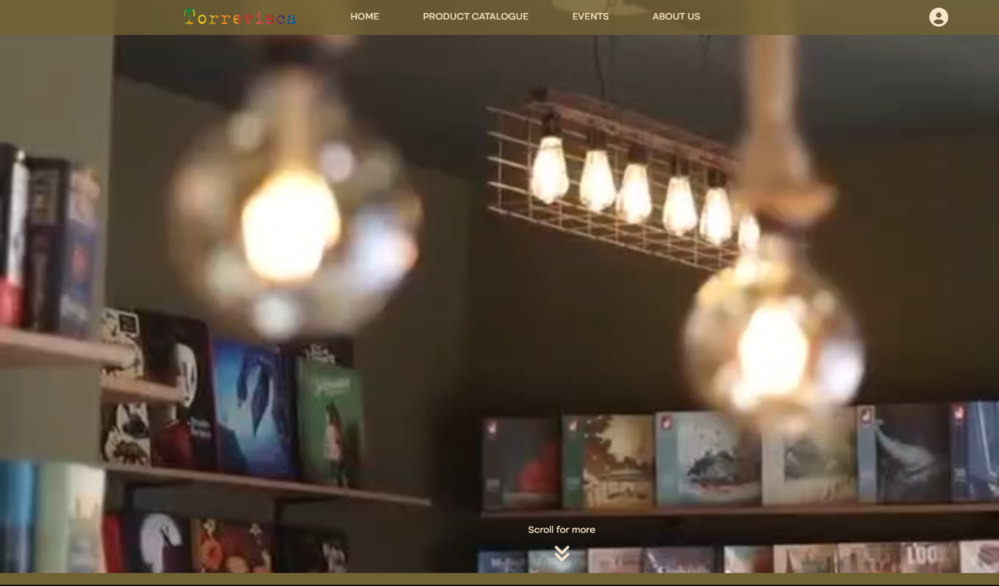

# Llibreria-Torrevisca

## Description:

A website for the bookshop Llibreria Torrevisca in Cambrils, Spain.   The site provides information on the store’s current products, upcoming events and the team. 

 

## Screenshot:

 

 

## Link to deployed application:
llibreria-torrevisca.netlify.app

 
 

## Technologies Used:

- Firebase
- Javascript
- Node.js
- React

 

## Collaborators:

- Rosa
- Kai
- Kane
 
 
 

## Licensing:

MIT License
Copyright (c) 2023 RlucSal
